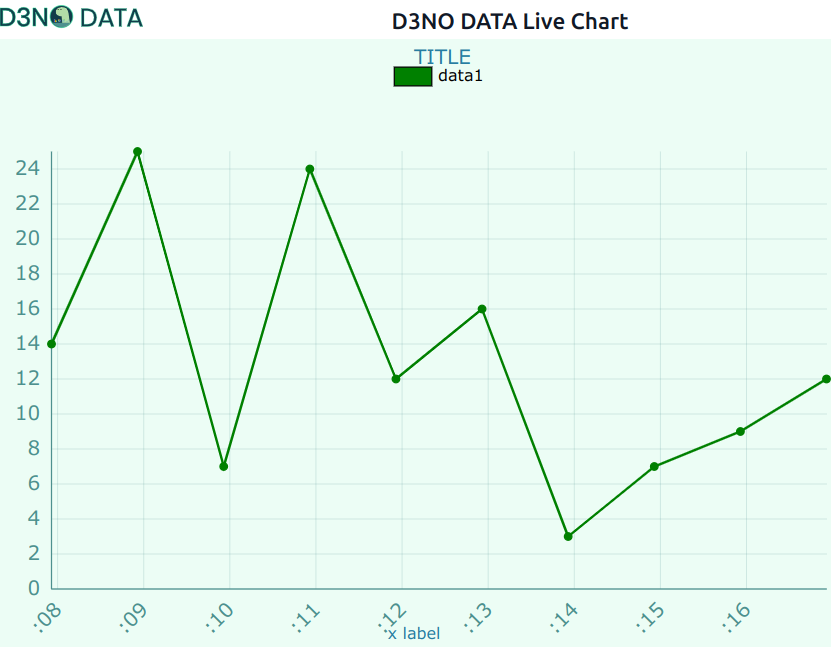
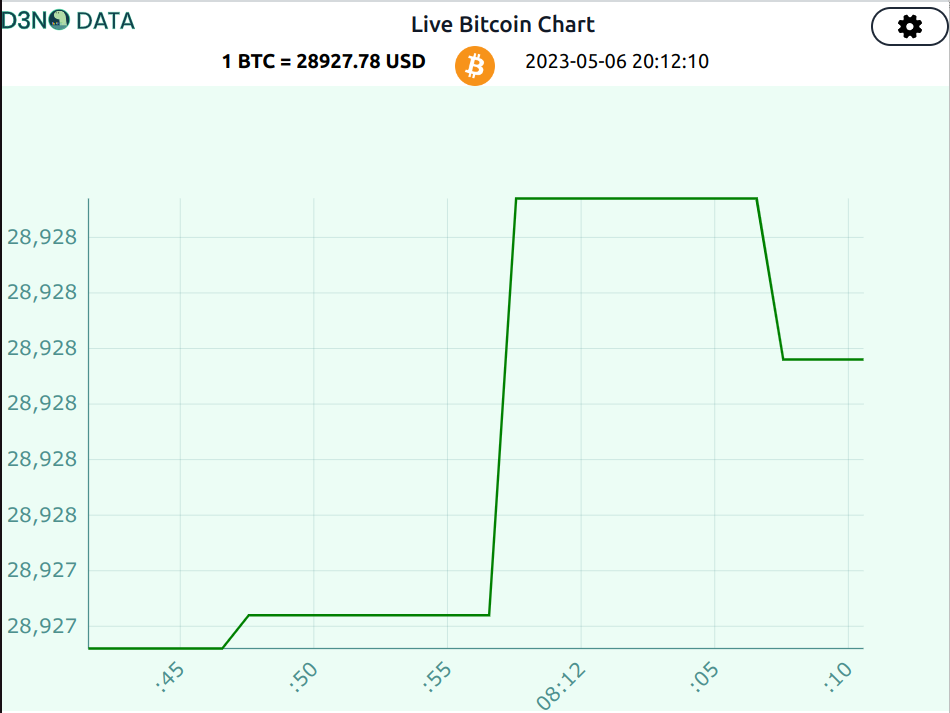

## d3no-chart

d3no-chart is a fork of d3no-data. It adds the functionality of live updating a line chart.

## Examples

   
   

  <a href="https://livechartsimple.deno.dev/">
    https://livechartsimple.deno.dev/</a> 

   

   

  <a href="https://livechartbtc.deno.dev/">
    https://livechartbtc.deno.dev/</a> 

**d3n0-chart** on deno.land:
  <a href="https://deno.land/x/d3no-chart">
    deno.land
  </a>

## Original Project D3NO DATA

</img>

**D3NO DATA** on github:
  <a href="https://github.com/oslabs-beta/d3no-data">
    github
  </a>

**D3NO DATA** homepage:
  <a href="https://d3nodata.deno.dev/">
    homepage
  </a>

**D3NO DATA** on deno.land:
  <a href="https://deno.land/x/d3nodata">
    deno.land
  </a>

**D3NO DATA** is a chart component library written in D3.js and Preact, designed to be a simple but fully-featured way to implement D3 in Fresh projects at the lowest possible performance cost.

Key Features:
- Fully modular, lightweight charts with only one introduced dependency: D3
- A variety of charts, accepting one or multiple data sets where appropriate
- Entire feature set of D3 through the imported components
- Customizable chart appearance, with default parameters to make it simpler to "plug n' play"
- Efficient utilization of Preact to render changes to input data or parameters

## Documentation

The documentation is available [on the website](https://d3nodata.deno.dev/docs).

